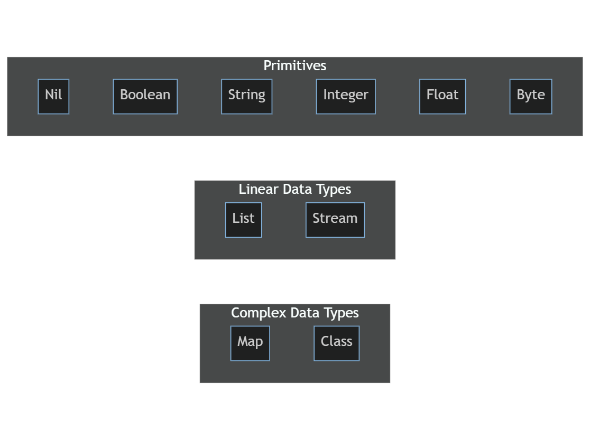

<h1 align="center">up</h1>
<p align="center">Experimental: Thread-friendly interpreter programming language</p>
<p align="center"></p>

## Features

- Optimized for lightweight threading.
- Strongly influenced by both the Go (Golang) and Python programming languages.
- While garbage collection (GC) exists, it minimizes lock overhead by leveraging the CAS Atomic Operator.
- It's a dynamically typed language; however, users can specify strong types for instances where high performance is a necessity.
- Features a straightforward and easily comprehensible grammatical structure.
- Developed as an experimental language, intended for long-term project exploration and refinement.

## Overview

The `up` language aspires to marry the ease of use seen in languages like Python with the concurrency advantages inherent to languages like Go. Its design philosophy centers on offering a platform where developers can utilize threads without confronting the usual associated intricacies. As a unique proposition in the programming language spectrum, `up` merits exploration by those keen on advancing the paradigms of contemporary programming.

## Getting Started

```bash
go run . {.up file path}
```

Example:

```bash
go run . examples/for_loop.up
```

Look [examples/](./examples) to see more examples.
This project is working in progress. There may be an error in the code's behavior.

**Demo video**

[](https://youtu.be/U9f3PYHm6fk)

## Specs

### What is this project for?

In terms of taking Up in the direction of Go performance-wise, we plan to make three big improvements to the interpreter.

1. adding the concept of typed (rather than typed) assignments to variables, to improve dynamic conversion inefficiencies in inter-variable operations.

2. scheduling threads at runtime in the interpreter to minimize system space transitions, streamlining thread resources by reducing the proportion of kernel calls, and attempting to avoid the problems of Python's GIL in runtime design based on CAS atomic operators and communication sequential processes (CSP). (Making threads as efficient as possible in the interpreter is the main goal of this project).

3. minimizing the critical section by using Sweep Algorithm without using GC's RefCount.

This is a draft of the project direction, and we believe that these three main requirements distinguish this project as an experimental project that attempts to improve performance in the interpreter.

### Background

Up Language draws inspiration from both Go and Python, combining the performance-oriented aspects of Go with the user-friendly characteristics of Python. Here are some key differences that set Up apart:

- **Performance and Ease of Use:** Up strikes a balance by adopting Go's performance while maintaining a focus on ease of use, making it versatile for various programming tasks.

- **Interpreter Language:** Like Python, Up supports an interpreter-based approach, enabling developers to write and test code more efficiently.

- **Class Support:** Like Python, Up Language embraces class support, allowing for object-oriented programming.

- **Thread Friendliness:** Similar to Go, Up allows for lightweight threading, potentially leading to thread friendliness.

- **Lightweight Threads:** Up introduces lightweight threads and communication between them through streams, facilitating concurrency.

- **Dynamic Typing:** Up supports dynamic typing, providing flexibility in programming.

- **Strong Typing (Variable-level):** Similar to Go, Up allows for strong typing at the variable level, potentially leading to performance improvements.

- **Class Receiver Definitions:** Unlike Go and Python, Up enables class receiver definitions, enhancing object-oriented programming capabilities.

- **Anonymous Functions:** Up Language encourages the use of anonymous functions, allowing developers to define functions without a formal name. This is particularly useful for creating small, specialized functions on the fly.

- **Built-in Higher-Order Functions:** Up Language offers a rich set of built-in higher-order functions that operate on functions, making it easier to work with collections, apply transformations, and manage control flow in a functional style.

## Up's directionality (compared to Go and Python)

| Characteristic                     | Up Language                    | Go Language                | Python Language            |
| ---------------------------------- | ------------------------------ | -------------------------- | -------------------------- |
| **Performance**                    | 🟡 Partial Performance-focused | 🟢 Performance-focused     | 🟡 Emphasizes Ease of Use  |
| **Ease of Use**                    | 🟢 Prioritizes Ease of Use     | 🟡 Prioritizes Ease of Use | 🟢 Prioritizes Ease of Use |
| **Engine**                         | Interpreter (Runtime, JIT)     | Compiler                   | Interpreter (Runtime, JIT) |
| **Composition**                    | Class                          | Struct                     | Class                      |
| **Garbage Collection (GC)**        | ✅ Sweep algorithm             | ✅ Sweep algorithm         | ✅ Refcount algorithm      |
| **Lightweight Threads (Stream)**   | ✅ Supported (Up)              | ✅ Supported (Go)          | ❌ Not Supported           |
| **Dynamic Typing Support**         | ✅ Supported                   | ✅ Supported               | ✅ Supported               |
| **Thread Friendliness**            | ✅ Supported                   | ✅ Supported               | ❌ Not Supported           |
| **Strong Typing (Variable-level)** | ✅ Supported                   | ✅ Supported               | ❌ Not Supported           |
| **Receiver Definitions**           | ✅ Supported                   | ❌ Not Supported           | ❌ Not Supported           |

### Data Structure

Below is the data structures diagram.



| Data Structure         | Description                                                                                                       |
| ---------------------- | ----------------------------------------------------------------------------------------------------------------- |
| **Primitives**         | This section includes basic data types such as nil, bool, string, int, float, and byte.                           |
| **Linear Data Types**  | The Linear Data Types section includes list and stream, which represent sequential data structures.               |
| **Complex Data Types** | The Complex Data Types section includes map and `class`. These data types are composed of multiple data elements. |

## Contributing

Contributions to this project are appreciated. For additional details, please consult the CONTRIBUTING.md document.

## License

This project is licensed under the Apache License 2.0. Detailed licensing information can be accessed in the [LICENSE](LICENSE) file.
